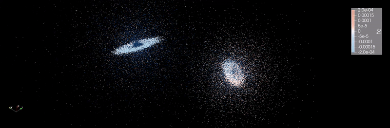

A parallel N-Bodies solver, built using fortran-package-manager. To build, first install fortran package manager, and nvhpc. Then: 
```
chmod +x ./build_nv.sh 
./build_nv.sh 
```
This will generate 4 executables: 
1. `mynbodies_serial_out` : A basic serial N-body solver
2. `mynbodies_myomp_out` : An OpenMP parallelized solver for thread based CPU parallelization
3. `mynbodies_omp_out` : An LLM generated OpenMP solver. Similar performance was seen.
4. `mynbodies_acc_out` : An OpenACC solver for GPU parallelization, featuring a one-time data transfer avoiding redundant and repeated host-device copies.
5. `mynbodies_cuda_out` : A CUDA Fortran solver for GPU parallelization, using explicit memory management.

The force calculations in all of these follow a vary naive implementation with `N x N` calculations. I am well aware that far more sophisticated methods like PPM exist, or that you can implement variable time steping with RK 45 like methods but since this is just a personal project to teach myself CUDA fortran, I am not interested nor do I have the time.

Observed a 25-32x speedup with an OpenACC simulation on an NVIDA a100 and 38-55x with CUDA Fortran compared to an OpenMP CPU simulation on a 48 core Intel Xeon Gold Cascade Lake 6248R. 
1. With 43802 bodies

| Method | Machine | Time per timestep (s) | Relative Speedup vs Serial | Relative Speedup vs OpenMP |
|--------|---------|----------------------|----------------------------|----------------------------|
| **Serial** | Intel Xeon Gold Cascade Lake 6248R (1 core) | 40.804 | 1 | 0.01679 |
| **OpenMP** | Intel Xeon Gold Cascade Lake 6248R (48 cores) | 0.685 | 59.5679 | 1 |
| **OpenACC** | Nvidia a100 | 0.0277 | 1473.07 | 24.7292 |
| **CUDA Fortran** | Nvidia a100 | 0.0176 | 2318.41 | 38.9205 |

2. With 81920 bodies
   
| Method | Machine | Time per timestep (s) | Relative Speedup vs Serial | Relative Speedup vs OpenMP |
|--------|---------|----------------------|----------------------------|----------------------------|
| **Serial** | Intel Xeon Gold Cascade Lake 6248R (1 core) | 147.367 | 1 | 0.0167 |
| **OpenMP** | Intel Xeon Gold Cascade Lake 6248R (48 cores) | 2.465 | 59.78 | 1 |
| **OpenACC** | Nvidia a100 | 0.0737 | 1999.55 | 33.45 |
| **CUDA Fortran** | Nvidia a100 | 0.0446 | 3304.19 | 55.27 |


These will generate .csv file outputs which can be visualized using Paraview. I also experimented with LAMMPS dump format but dumped that idea as ParaView can be a bit glitchy. 
Shout out to https://github.com/lele394 for help with the pre-processing scripts. Julia pre-processing scripts in the Input folder were LLM generated.

Simulation examples : These setups were obtained from a UMD database (https://bima.astro.umd.edu/nemo/archive/). Have not validated these as I am not in the field: 
1. Galactic collision between the milky way and the andromeda galaxy (Dubinski, Mihos & Hernquist, 1996, ApJ, 462, 576) : ~80k stars 
   
2. Galactic Bulge: Based on  Sellwood (1993) A Bar model for the Galactic Bulge . : ~ 40k stars
   
